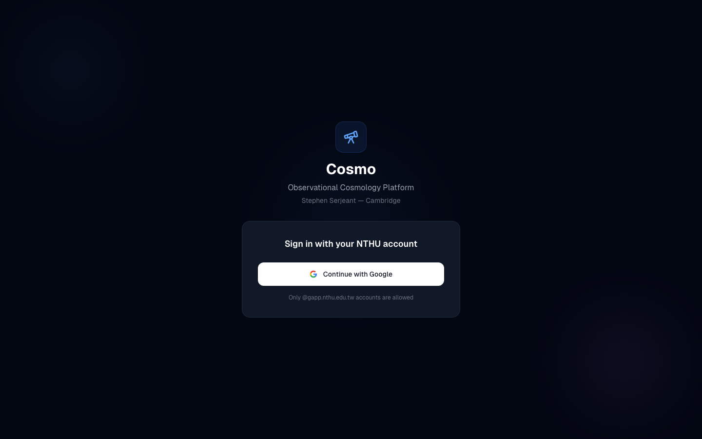
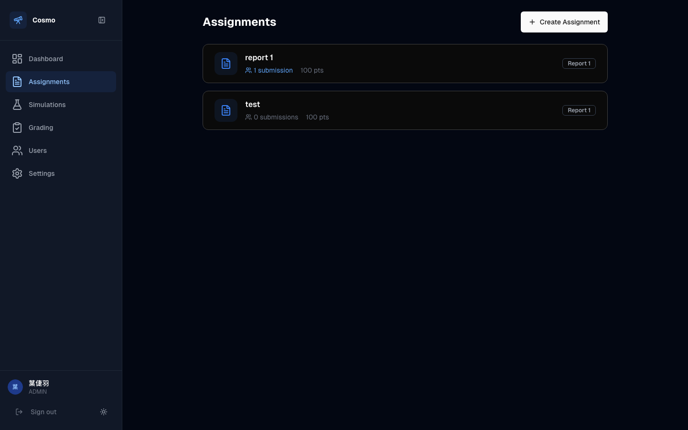
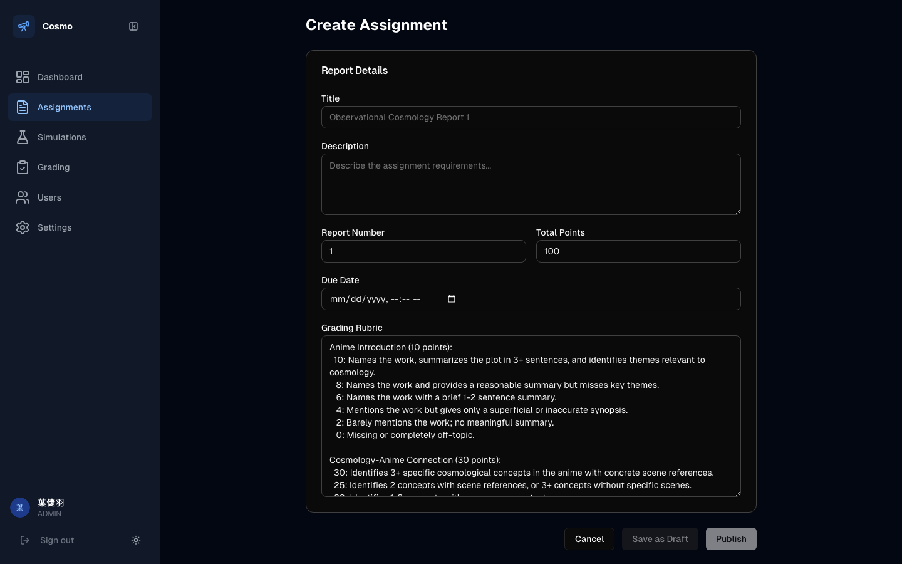
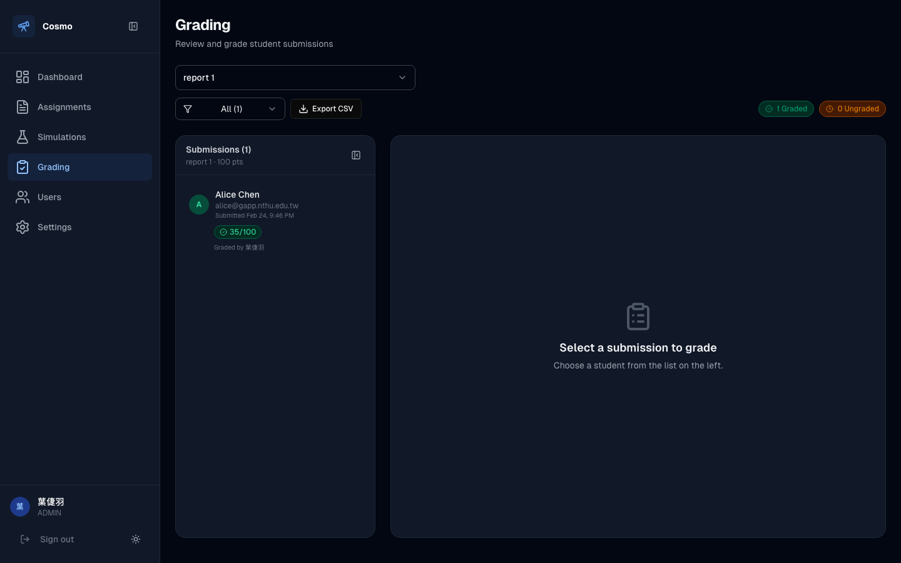
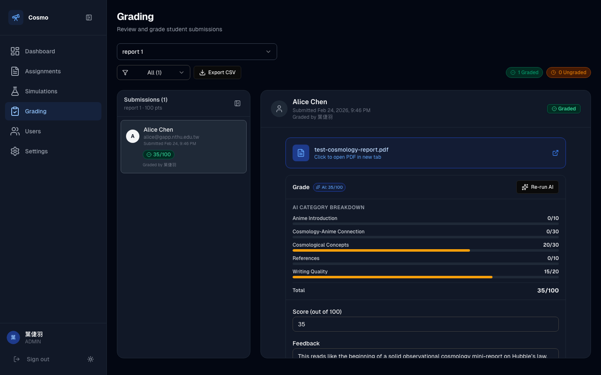
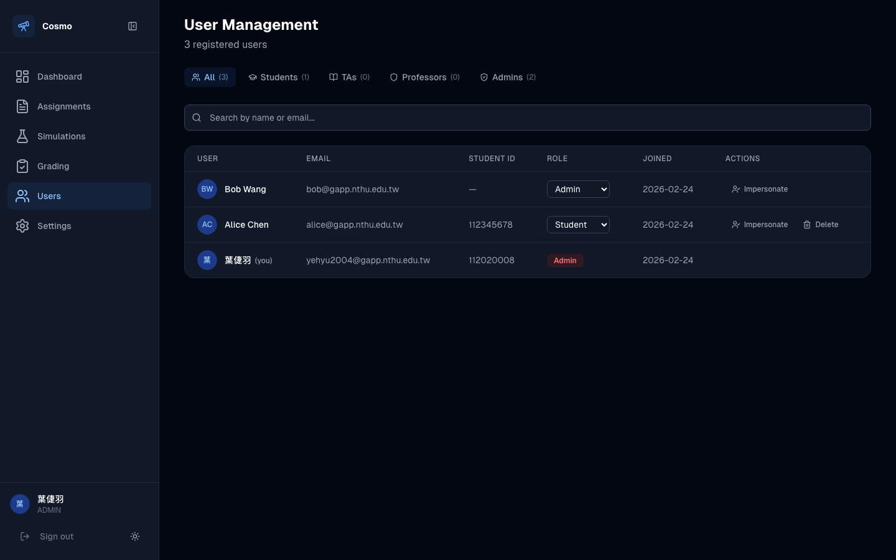
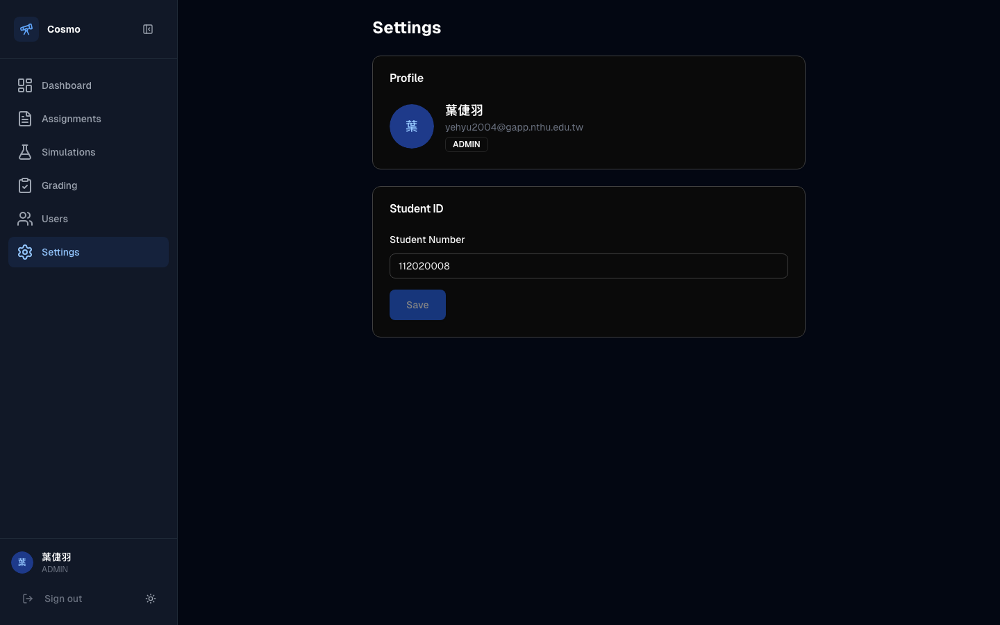

# Cosmo Platform — TA Handbook

A guide for Teaching Assistants on using the Observational Cosmology grading platform.

---

## Table of Contents

1. [Logging In](#1-logging-in)
2. [Dashboard](#2-dashboard)
3. [Managing Assignments](#3-managing-assignments)
4. [Grading Submissions](#4-grading-submissions)
5. [AI-Assisted Grading](#5-ai-assisted-grading)
6. [Exporting Grades](#6-exporting-grades)
7. [User Management (Admin)](#7-user-management-admin)
8. [Settings](#8-settings)
9. [What Students See](#9-what-students-see)

---

## 1. Logging In

Navigate to the platform URL. You will see the login page.

- Click **Continue with Google** and sign in with your `@gapp.nthu.edu.tw` account.
- Only NTHU Google accounts are accepted.
- Your account is created automatically on first login with the STUDENT role. Ask the professor or admin to promote you to TA.

---

## 2. Dashboard

After logging in, you land on the Dashboard.

The dashboard shows:

- **Overview cards** — Total Students, number of Assignments, and how many submissions need grading ("To Grade").
- **Quick Start** — Shortcut buttons to jump to Assignments, Simulations, Create Assignment, or Grading.
- **Recent Activity** — Two panels:
  - **Recent Submissions** — The latest student submissions with their grading status (e.g., "Needs grading" or score like "35/100").
  - **Submission Status** — Per-assignment summary showing how many have been submitted and graded, with badges like "Complete", "1 to grade", or "No submissions".

### Navigation

The **sidebar** on the left provides access to all sections:

| Menu Item | Who Can See | Description |
|-----------|------------|-------------|
| Dashboard | Everyone | Overview and activity feed |
| Assignments | Everyone | View and manage assignments |
| Simulations | Everyone | Interactive cosmology demos |
| Grading | TA, Professor, Admin | Grade student submissions |
| My Grades | Students only | View received grades |
| Users | TA, Professor, Admin | Manage user accounts |
| Settings | Everyone | Profile and student ID |

The sidebar can be collapsed using the collapse button (top-right of the sidebar) to maximize workspace. On mobile, tap the hamburger menu (☰) to open navigation.

---

## 3. Managing Assignments

### Viewing Assignments

Click **Assignments** in the sidebar to see all assignments.

Each assignment card shows:
- **Title** (e.g., "report 1")
- **Submission count** (highlighted in blue if there are submissions)
- **Total points** (e.g., 100 pts)
- **Report number** badge

### Creating an Assignment

Click **+ Create Assignment** (top-right) to create a new assignment.

Fill in:
- **Title** — Name of the assignment (e.g., "Report 1: Hubble's Law")
- **Description** — Instructions for students
- **Report Number** — Select Report 1 or Report 2
- **Due Date** — Optional deadline
- **Total Points** — Maximum score (default: 100)
- **Rubric** — Grading criteria text that the AI grader will use as reference
- **Published** — Toggle to make it visible to students

> **Tip:** Write a detailed rubric. The AI grading assistant uses it to evaluate submissions and generate category-by-category scores.

---

## 4. Grading Submissions

Click **Grading** in the sidebar. This is where you review and grade student submissions.

### Step 1: Select an Assignment

Use the dropdown at the top to choose which assignment to grade. If there are ungraded submissions, the platform auto-selects the most urgent assignment.

The grading page shows:
- **Assignment dropdown** — Switch between assignments
- **Filter** — Toggle between "All", "Ungraded", or "Graded" submissions
- **Export CSV** — Download grades as a spreadsheet
- **Status badges** — Green "X Graded" and orange "X Ungraded" counts in the top-right
- **Submissions list** (left panel) — All students who submitted, with their score and status

### Step 2: Select a Submission

Click on a student's name in the left panel to open their submission.

The right panel shows:
- **Student info** — Name, email, submission date, and grading status
- **PDF link** — Click to open the submitted PDF in a new tab
- **Grade section** — AI score badge, category breakdown, score input, and feedback textarea
- **AI Category Breakdown** — Per-category scores with progress bars (if AI grading has been run)
- **Score input** — Enter or adjust the final score
- **Feedback textarea** — Write feedback for the student

### Step 3: Enter Score and Feedback

1. Review the student's PDF by clicking the file link.
2. Look at the AI-suggested score and category breakdown (if available).
3. Enter the final **Score** in the input field (you can accept or override the AI suggestion).
4. Write **Feedback** in the textarea — this is what the student will see.
5. Click **Save Grade** to finalize.

### Returning an Assignment

If a student needs to resubmit, click **Return to Student** at the bottom of the grading panel. This clears the grade and allows the student to upload a new file.

---

## 5. AI-Assisted Grading

The platform includes an AI grading assistant powered by OpenAI.

### Running AI Grading

1. Select a submission in the grading panel.
2. Click **Run AI** (or **Re-run AI** if it's been run before).
3. The AI will:
   - Extract text from the student's PDF
   - Evaluate it against the assignment rubric
   - Generate a score with per-category breakdown
   - Write feedback text

### AI Category Breakdown

The AI scores each rubric category separately. In the screenshot above, you can see:

| Category | Score | Description |
|----------|-------|-------------|
| Anime Introduction | 0/10 | How well the student introduced their chosen anime/sci-fi work |
| Cosmology-Anime Connection | 0/30 | How well cosmology concepts were mapped to the narrative |
| Cosmological Concepts | 20/30 | Accuracy and depth of cosmology content |
| References | 0/10 | Quality of citations and references |
| Writing Quality | 15/20 | Clarity, structure, and grammar |
| **Total** | **35/100** | |

Progress bars give you a visual sense of each category's performance.

### Important Notes

- AI scores are **suggestions only** — always review before saving.
- You can **override** the AI score by typing a different number in the Score field.
- You can **edit** the AI-generated feedback text before saving.
- Click **Re-run AI** to regenerate if you've updated the rubric.
- There is a rate limit (1 AI request per minute) to prevent abuse.

---

## 6. Exporting Grades

To export all grades for an assignment:

1. Go to **Grading** and select the assignment.
2. Click the **Export CSV** button in the toolbar.
3. A CSV file will download with columns: Student Name, Email, Student ID, Score, Feedback, Submitted Date, Graded Date.

This is useful for uploading grades to the university's grade system.

---

## 7. User Management (Admin)

If you have Admin privileges, click **Users** in the sidebar.

### Features

- **Filter tabs** — Filter by role: All, Students, TAs, Professors, Admins
- **Search** — Search users by name or email
- **Role dropdown** — Change a user's role (e.g., promote a student to TA)
- **Impersonate** — View the platform as another user (useful for debugging student issues)
- **Delete** — Remove a user account (only for users with lower privilege)

### Changing Roles

To promote a student to TA:
1. Find the student in the list.
2. Change the **Role** dropdown from "Student" to "TA".
3. The change takes effect immediately.

### Impersonation

Click **Impersonate** next to a user's name to see the platform from their perspective. This is helpful for:
- Verifying what a student sees after grading
- Debugging submission issues
- Testing role-based access

A banner at the top will indicate you are impersonating. Click "Stop impersonating" to return to your account.

---

## 8. Settings

Click **Settings** in the sidebar to view your profile and update your student ID.

- **Profile section** — Shows your name, email, and role (read-only, from Google)
- **Student ID** — Enter your student number. Click **Save** (the button is disabled when there are no changes, and shows "Saving..."/"Saved!" feedback).

---

## 9. What Students See

### Assignment Detail & Submission

When a student clicks on an assignment, they see the submission page:

Students can:
- View the assignment title, points, and due date
- See their **submitted file** with a "View" button to open the PDF
- See their **grade and feedback** after the TA has graded it
- See a message about requesting resubmission if needed

### My Grades

Students see all their graded submissions on the **My Grades** page. If no grades are available yet, they see a helpful empty state with a link to view assignments.

### Key Points for Students

- Students upload **one PDF** per assignment
- They **cannot resubmit** once graded — only a TA can return the assignment
- Grades and feedback are visible immediately after the TA saves them
- The feedback text you write is shown directly to the student

---

## Quick Reference

| Action | Where | How |
|--------|-------|-----|
| Grade a submission | Grading page | Select assignment → click student → enter score → Save Grade |
| Run AI grading | Grading page | Select submission → click "Run AI" |
| Create assignment | Assignments page | Click "+ Create Assignment" |
| Export grades | Grading page | Select assignment → click "Export CSV" |
| Promote to TA | Users page | Change role dropdown |
| See as student | Users page | Click "Impersonate" |
| Return assignment | Grading page | Select submission → click "Return to Student" |

---

*Last updated: February 2026*
